# Документация JMStack

## Работа c git

### Клонирование проекта

1. На странице репозитория убедитесь, что выбрана ветка **dev** (1), нажмите кнопку **Clone** (2), скопируйте ссылку (3).

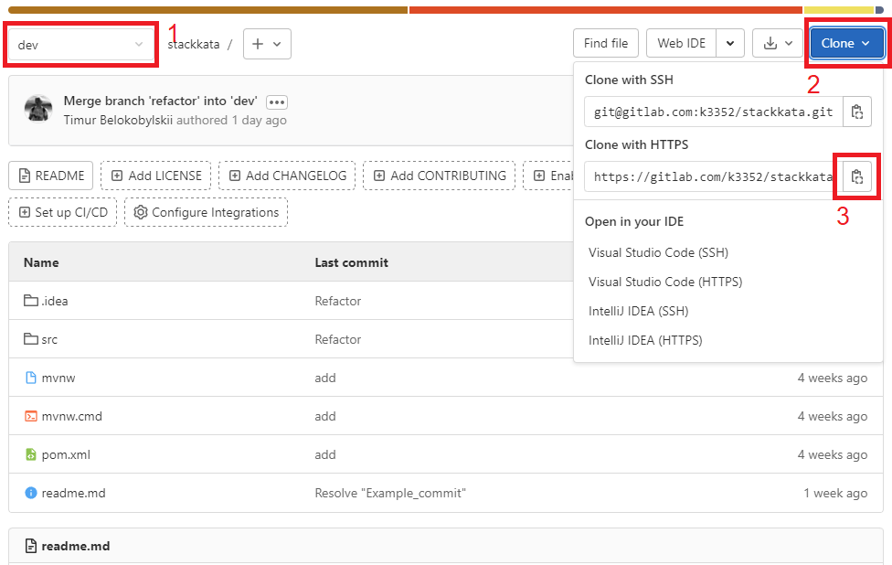

2. Откройте **Intellij IDEA**, нажмите **Get from version control** на экране приветствия, либо **VCS | Git | Clone...**
   в меню.

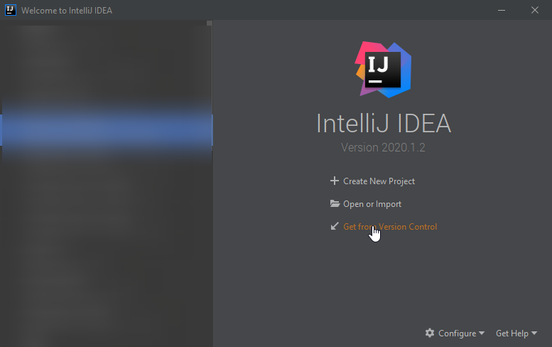

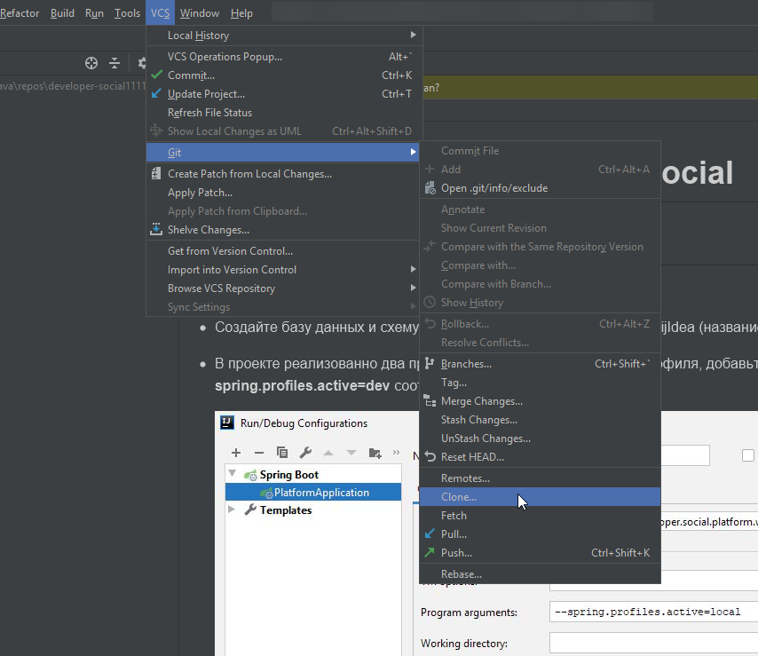

3. Вставьте скопированную ссылку в строку **URL**, нажмите **Clone**.

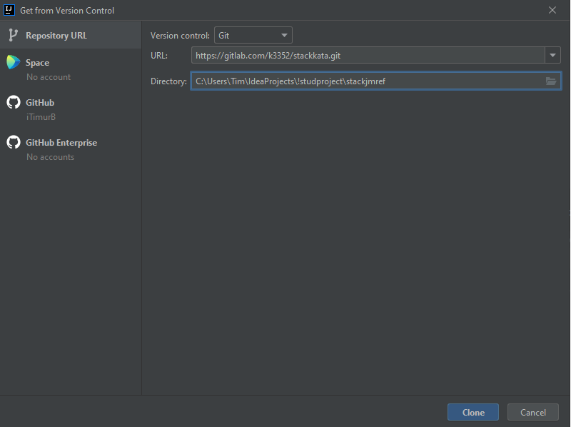

### Перед внесением изменений в код

### Создание merge request

Создайте новую ветку в git-репозитории и работайте в ней. Для этого:

1. Перейдите в свою таску с которой планируете работать, нажмите на выпадающее меню "1", проверьте название ветки "2" (измените название, если необходимо), создайте request "3".

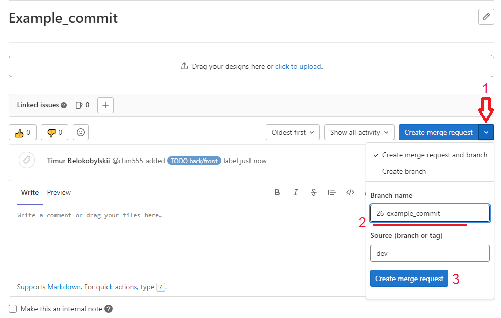

2. В созданном merge request, проверьте Title "1" (Draft - черновик, оставляем так), нажимаем "2" - Create merge
   request.

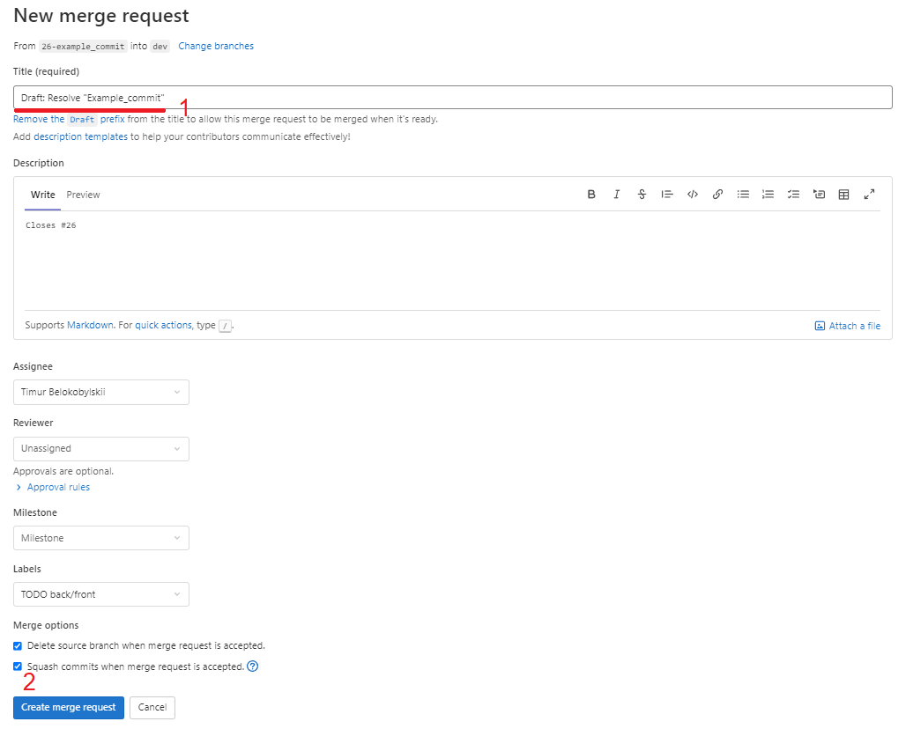

3. Перейдите обратно в таску и проверьте создание ветки.

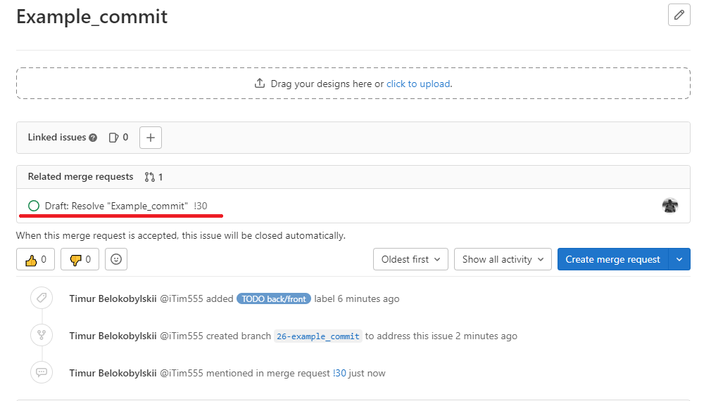

4. Переходим в проект и обновляем ветку **dev**


5. После обновления **dev** находим и переходим в свою созданную ветку

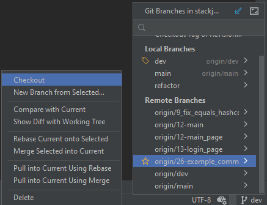

6. Работаем в своей ветке

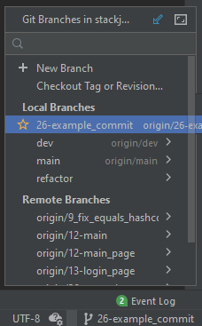

### Добавление своего кода в общий репозиторий. Git push.

Прежде чем создать merge request вам необходимо подготовить вашу ветку к отправке в общий репозиторий.

1. Нажмите на текущую ветку в правом нижнем углу. Выберите опцию **dev | update**.
   Таким образом вы скачаете в свою локальную ветку **dev** все коммиты которые были замержены,
   пока вы работали в своей ветке.

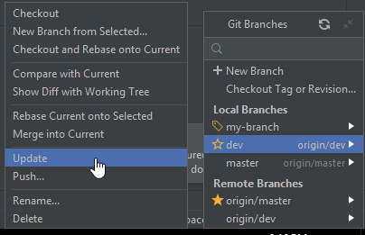

2. Убедитесь, что в данный момент активна ваша рабочая ветка (значок ярлыка слева от имени, как у ветки my-branch на скриншоте).
Выберите опцию **dev | Merge into Current**. Таким образом вы добавите все изменения из ветки **dev** в вашу ветку.
При возникновении конфликтов разрешите их.

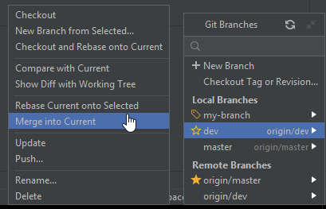

### 3. **---**ВАЖНО**--- Убедитесь что проект собирается и запускается.**

4. Далее **Commit...** и **Push...**, чтобы добавить её в общий репозиторий.

### Передача кода на проверку

1. Перед передачей кода на проверку, перейдите в свою таску и переименуйте префикс в **Resolve**.

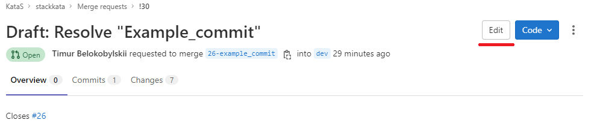

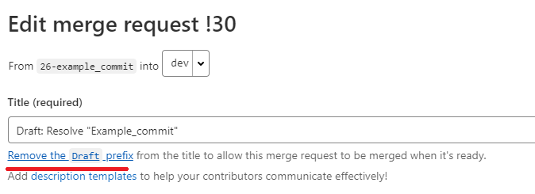

2. Переместите таску в лист **Need review**.

## Описание проекта

## Сущности

Каждый сервисный и дао классы, как интерфейсы так и реализации, должны иметь родителя.
В проекте есть базовые родительские интерфейсы и реализации: ReadOnlyDao (ReadOnlyDaoImpl), ReadWriteDao (ReadWriteDaoImpl),
ReadOnlyService (ReadOnlyServiceImpl), ReadWriteService (ReadWriteServiceImpl).

### User

#### Поля:

- **id** - уникальный идентификационный номер пользователя;
- **fullName** - полное имя пользователя;
- **password** - пароль;
- **persistDateTime** - дата регистрации;
- **role** - идентификационный номер пользователя;
- **lastUpdateDateTime** - дата последней авторизации;
- **email** - адрес электронной почты;
- **about** - краткая информация о пользователе;
- **city** - город пользователя;
- **linkSite** - ссылка на сайт;
- **linkGitHub** - ссылка на github;
- **linkVk** - ссылка на страницу во Вконтакте;
- **isEnabled** - отметка, что учетная запись не заблокирована;
- **image** - фото пользователя;

```
Пользователь может задавать вопросы, отвечать на вопросы и давать комментарии к вопросам и ответам.
Наделен ролью.Может помечать понравившиеся вопросы, отмечать вопросы которые были полезны. Заданный
вопрос может отметить, как решенный, указав на ответ, который помог решить проблему.
```

### Role

#### Поля:

- **id** - уникальный идентификационный номер роли;
- **name** - имя роли;

```
Определяет порядок прав действий пользователя в системе.
```

### Question

#### Поля:

- **id** - уникальный идентификационный номер вопроса;
- **title** - заголовок вопроса;
- **description** - описание вопроса;
- **persistDateTime** - дата публикации вопроса;
- **viewCount** - количество просмотров;
- **user** - идентификационный номер пользователя, опубликовавший вопрос;
- **tags** - теги, которыми обозначен вопрос;
- **lastUpdateDateTime** - дата последней редакции вопроса или добавления ответа;
- **isDeleted** - флаг, помечающий объект, как удалённый. Отображаться при запросе данный вопрос не будет;

```
Сущность, которую инициализирует пользователь для публикации своего вопроса. Имеет заголовок, который кратко 
описывает суть вопроса, развернутое описание, с возможностью вставки фрагмента кода. Может быть помечен полями
“решен”, “любимый вопрос”. Отметка “решен” проставляется автором вопроса, с указанием ответа, который помог
решить возникший вопрос. Отметка “любимый вопрос” ставиться любым пользователем, который посчитал вопрос
актуальным и интересным. ”Тэг” проставляется автором вопроса, для классификации вопроса. Под вопросом может
также быть оставлен комментарий любым пользователем, включая автора вопроса.
```

### VoteQuestion

#### Поля

- **user** - пользователь, который отправил свой голос;
- **question** - вопрос, по которому ведётся голосование;
- **localDateTime** - дата и время отправки голоса;
- **vote** - значение голоса, который отправил пользователь по вопросу;

```
Таблица, которая содержит в себе записи голосования пользователей по вопросам. В таблице используется
сборный внешний ключ, который состоит из полей user, qustion, localDateTime. Для создания необходимо
передать сущности User, Question и значения голоса. Допускается передача значений только "1" и "-1".
Пользователь может проголосовать за один вопрос только с отклонением в 1 пункт. Допускается, что пользователь
может отменить свой голос, отправив противоположное значение предыдущего голоса. Или изменить свой итоговый
голос, при этом отправив повторно обратное значение. Все действия пользователя сохраняются в таблице.
Итоговое значение "полезности вопроса" является сумма всех голосов.
```

### Answer

#### Поля:

- **id** - уникальный идентификационный номер ответа;
- **user** - идентификационный номер пользователя, который опубликовал ответ;
- **question** - идентификационный номер вопроса, к которому относиться ответ;
- **htmlBody** - тело ответа;
- **persistDateTime** - дата публикации ответа;
- **updateDateTime** - дата публикации ответа;
- **isHelpful** - отметка, что именно этот ответ помог решить вопрос, к которому оно относиться. Эту
  отметку может ставить только автор вопроса;
- **dateAcceptTime** - дата, решения вопроса;
- **isDeleted** - флаг, помечающий объект, как удалённый. Отображаться при запросе данный ответ не будет;

```
Сущность, которую инициализирует пользователь отвечая на вопрос. Привязан к сущности question. Ответ на
вопрос может оставлять любой пользователь. Может быть предложено несколько вариантов ответов на опубликованный
вопрос. Ответ может быть помечен автором вопроса, к которому был оставлен ответ, как “решение помогло”,
обозначая тем самым, что сам вопрос решён и помог прямо или косвенно данный ответ. Под ответом пользователи
могут оставлять комментарии, которые уточняют или дополняют предложенное решение. Каждый пользователь может
оставлять под вопросом только один ответ.
```

### AnswerVote

#### Поля

- **user** - пользователь, который отправил свой голос;
- **answer** - ответ, по которому ведётся голосование;
- **persistDateTime** - дата и время отправки голоса;
- **vote** - значение голоса, который отправил пользователь по ответу;

```
Таблица, которая содержит в себе записи голосования пользователей по ответам. В таблице используется
сборный внешний ключ, который состоит из полей user, answer, persistDateTime. Для создания необходимо
передать сущности User, Answer и значения голоса. Допускается передача значений только "1" и "-1".
Пользователь может проголосовать за один вопрос только с отклонением в 1 пункт. Не допускается, что пользователь
может отменить свой голос. Все действия пользователя сохраняются в таблице.
```

### Comment

#### Поля:

- **id** - уникальный идентификационный номер комментария;
- **user** - идентификационный номер пользователя, который оставил комментарий;
- **text** - содержание комментария;
- **persistDateTime** - дата публикации комментария;
- **lastUpdateDateTime** - дата последней редакции;
- **commentType** - тип комментария. Идентифицирует родительскую сущность, к которой был оставлен комментарий (вопрос или ответ);

```
Комментарий оставляется пользователем под любым вопросом или ответом, для уточнения или дополнения к основному
посту.
```

### User_favorite_question

#### Поля:

- **id** - уникальный идентификационный номер записи об отмеченном вопросе;
- **persistDateTime** - дата постановки отметки “понравившейся вопрос”;
- **user** - идентификационный номер пользователя, который отметил вопрос, как понравившийся;
- **question** - идентификационный номер вопроса, который пользователь отметил, как понравившейся;

```
Отметка понравившегося вопроса проставляется пользователем, который счел вопрос интересным и/или полезным.
```

### Tag

#### Поля:

- **id** - уникальный идентификационный номер тега;
- **name** - название тега;
- **description** - описание тега;
- **persistDateTime** - дата создания тега;
- **questions** - список вопросов, которыми помечен данный тег;

```
Ставиться у сущности question для классификации вопроса.
```

### Related_tags

#### Поля:

- **id** - уникальный номер записи;
- **childTag** - идентификационный номер дочернего тега;
- **mainTag** - идентификационный номер родительского тега;

```
Категоризация тэгов. Показывает взаимосвязь общего с конкретным запросом. Например тэг “База данных” будет
иметь более широкую область запросов, в то время как тэг “Hibernate” будет более предметную область, которая
одновременно подходит под широкое использование тэга “База данных”.
```

### Tag_has_question

#### Поля

- **tag_id** - идентификационный номер тега;
- **question_id** - идентификационный номер вопроса;
- **persist_date** - дата отметки вопроса тегом;

```                                                  
Производная таблица связи many-to-many сущности вопросов и тегов.
```

### Editor

#### Поля:

- **id** - уникальный идентификационный номер редактора;
- **count** - правки сделанные за день
- **persist_date** - дата
- **user_id** - идентификационный номер пользователя;

```
Сущность, которая хранит в себе историю редактирования вопроса, 
ответа или комментария сделанных пользователями.
```

### Moderator

#### Поля:

- **id** - уникальный идентификационный номер модератора;
- **persist_date** - дата назначения;
- **user_id** - идентификационный номер пользователя;

```
Сущность, которая хранит пользователей чей статус являеться модератором. 
Привилегия, выдаваемая системой в зависимости от уровня репутации участника.
```

### Reputation

#### Поля

- **id** - уникальный идентификационный номер репутации
- **count** - баллы заработанные за день
- **persist_date** - дата
- **user_id** - идентификационный номер пользователя

```
Сущность, которая хранит в себе историю репутации пользователей по дням. 
Новый день новая запись, для каждого пользователя (если пользователь заработал баллы иначе записи не будет).  
```

### Badges

#### Поля

- **id** - уникальный идентификационный номер знака
- **badges** - имя знака
- **count** - минимальное количество очков репутации для получения знака
- **description** - описание знака

```
Сущность знаков.   
```

### user_badges

#### Поля

- **id** - уникальный идентификационный номер знака
- **ready** - имеет булевский тип, если помечается true знак получен
- **badges_id** - идентификационный номер знака
- **user_id** - идентификационный номер пользователя

```
Промежуточная сущность связывающая таблицы User и Badges.
User при регистрации получает все знаки лишь поле ready определяет заслужил пользователь знак или нет.
```

### Tag_ignored

#### Поля

- **id** - уникальный идентификационный номер знака
- **user** - ссылка на профиль пользователя
- **ignoredTag** - ссылка на тег
- **persistDateTime** - дата добавления тега в справочник

```
Справочник тегов которые пользователь добавляет в игнорируемые
```

### Tag_tracked

#### Поля

- **id** - уникальный идентификационный номер знака
- **user** - ссылка на профиль пользователя
- **trackedTag** - ссылка на тег
- **persistDateTime** - дата добавления тега в справочник

```
Справочник тегов которые пользователь добавляет в отслеживаемые 
```

### Bookmarks

#### Поля

- **id** - уникальный идентификационный номер закладки
- **user** - ссылка на профиль пользователя
- **question** - ссылка на вопрос

```
Таблица закладок
```

## Схема проекта.

[Схема](https://dbdiagram.io/d/6086b027b29a09603d12295d)

## Как пользоваться конвертором MapStruct.

**MapStruct** - это генератор кода, который значительно упрощает реализацию сопоставлений между типами Java-компонентов
на основе подхода соглашения по конфигурации.
Сгенерированный код сопоставления использует простые вызовы методов
и, следовательно, является быстрым, безопасным по типам и простым для понимания.
Более подробно можно ознакомиться в официальной документации: https://mapstruct.org/ .

В текущем проекте **Developer Social** технология **MapStruct** используется, в основном, для
преобразования **Dto** в **Entity** и наоборот.
Названия всех классов преобразования должны заканчиваться на «**Converter**» (например: **GroupChatConverter**) и должны храниться в пакете **converters**.
Такой класс должен быть абстрактным, помеченным аннотацией **@Mapper**. Данная аннотация отмечает класс
как класс сопоставления и позволяет процессору **MapStruct** включиться во время компиляции.
Методы должны быть абстрактными, из их названия должно быть явно понятно, какой класс
во что преобразуется. Например: (**chatDtoToGroupChat**- преобразует **ChatDto** в **GroupChat**).

Если соответствующие поля двух классов имеют разные названия, для их сопоставления
используется аннотация **@Mapping**. Эта аннотация ставится над абстрактным методом преобразования
и имеет следующие обязательные поля:

**source** - исходное поле преобразовываемого класса.
**target**- конечное поле класса, в котором должно быть значение из **source**.

Для разрешения неоднозначностей в именах полей классов можно указывать их с именем
соответствующего параметра метода преобразования.
Например: (**source** = "**chatDto.title**", где **chatDto** - имя параметра метода преобразования)

По умолчанию, метод должен принимать объект преобразовываемого класса, но также
можно передавать различные другие параметры(например **Id**) и подставлять их в **source**,
чтобы в дальнейшем поле **target** приняло это значение.

Могут возникнуть ситуации, что нужно преобразовать поле в другой тип данных, например
в коллекцию и наоборот. Тогда в аннотацию **@Mapping** следует добавить еще одно поле:
**qualifiedByName**, которое будет содержать имя метода, реализующего логику получения
нужного типа или значения. В таком случае этот метод должен быть помечен аннотацией
**@Named** с указанием названия для маппинга.
Ниже приведён общий пример:

````
{@Mapping(source = "chatDto.title", target = "title")
    @Mapping(source = "chatDto.image", target = "image")
    @Mapping(source = "userId",target ="users",qualifiedByName = "userIdToSet")
    public abstract GroupChat chatDtoToGroupChat(ChatDto chatDto,Long userId); }"
   

@Named("userIdToSet")
    public  Set<User> userIdToSet(Long userId) {
        User user = userService.getById(userId);
        Set<User> userSet = new HashSet<>();
        userSet.add(user);
        return userSet;
    }
````

# Как сверстать какую либо страницу

1. Последовательно добавить в **html** 3 **js** файла:

   ```
   <script type="text/javascript" src="/js/sidebar.js"></script>
   <script type="text/javascript" src="/js/header.js"></script>
   <script type="text/javascript" src="/js/footer.js"></script>
   ```
2. Создать первый тег в body:
   `<div class="container"></div>`

Получаем:

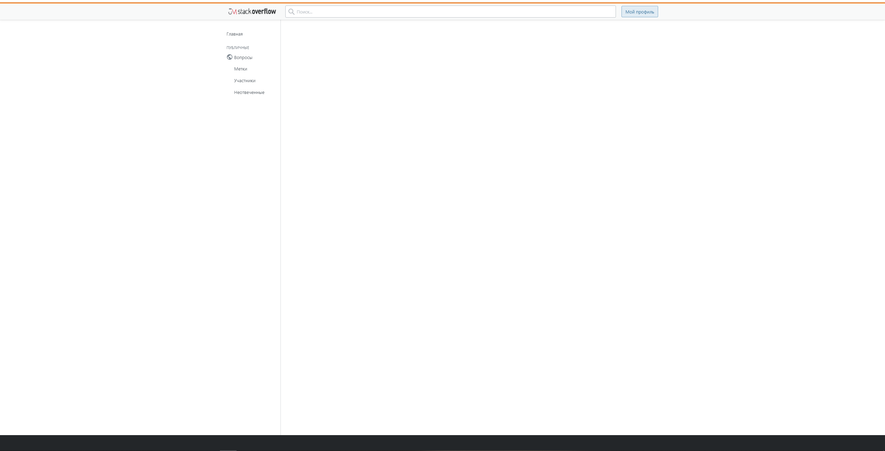

# Работа с Swagger

Swagger - это фреймворк, позволяющий автоматически, на основании кода и аннотаций
генерировать и обновлять интерактивную веб-документацию (Swagger UI) на ваши REST API,
в которой их можно непосредственно тестировать, отправляя запросы и получая ответы.

1. Для целей документации, по минимуму методы контроллера помечаются аннотацией
   например так:

```                                                  
@ApiOperation("Получение списка всех пользователей")
```

Swagger имеет также и другие полезные аннотации, рекомендуется их найти и изучить.

2. Для тех кто будет писать контроллеры и расписывать их аннотациями Swagger,
   документацию по созданному вами api можно будет смотреть и проверять здесь: http://localhost:8080/swagger-ui/


3. Сама документация будет формироваться автоматически на основании кода и аннотаций,
   ничего дополнительно обновлять или делать не нужно, в этом одна из прелестей Swagger.

# Работа с Liquibase

По мере разработки и поддержки приложения база данных изменяется:
добавляются таблицы, столбцы и т.д. Для упрощения отслеживания изменений существует **Liquibase**.
Мы делегируем выполнение скриптов этой библиотеке, а она в начале запуска приложения решает,
надо ли на конкретной базе выполнить конкретные скрипты, или же они в ней уже выполнены.

Работает **Liquibase** так: программист записывает все SQL-изменения базы данных
в специальном Liquibase-формате (xml, yaml, json, sql — на выбор).
А библиотека Liquibase запускает эти изменения, при этом Liquibase отслеживает саму себя — какие скрипты
она уже запускала, а какие еще нет.

#### Основные понятия:

**migration(миграция)** - любые изменения в БД, вследствие запуска одного или нескольких скриптов

**changeSet** - набор команд и инструкция которые должны быть применены к БД, при запуске

**changeLog** - файл, который содержит набор команд(changeSet)

# Docker

**Docker** - это инструмент, с помощью которого можно быстро и безопасно
развертывать (деплоить) приложения, создавая для них закрытую инфраструктуру,
необходимую только для них.

Подробнее о докере:
https://www.youtube.com/watch?v=EbEZgdTOHzE&list=PLD5U-C5KK50XMCBkY0U-NLzglcRHzOwAg
https://habr.com/ru/post/310460/

### Как поднять базу в Docker, подключиться и работать с ней?

1. Установите докер на Ваш пк и убедитесь что всё запускается и работает.

2. Создать файл **Dockerfile** в корне проекта с описанием того, что должно быть в контейнере.

- Первая строка — на основе чего будет состоять образ.

3. В корне проекта создаем файл **docker-compose.yml**

- Первая строка — это версия docker-compose.
- services: -относятся к сервисам, которые мы настраиваем (БД).
- build: context: . говорит о том, что мы будем искать Dockerfile в той же директории, что и docker-compose.yml.

# Как писать тесты к rest-контроллерам

### Основные требования

1. Тесты создаются согласно rest-контроллерам. Например, если есть ResourseAnswerController, то для него есть тест
   TestResourseAnswerController, в котором тестируются все api из контроллера.
2. Все сущности, описанные в датасетах для загрузки тестовых данных начинаются с id = 100.
3. Все тестовые классы должны наследоваться от абстрактного класса где описана вся конфигурация тестов.
4. НЕЛЬЗЯ ИЗМЕНЯТЬ УЖЕ НАПИСАННЫЕ ДАТАСЕТЫ! Если хотите добавить данные создаёте подпакет для вашего конкретного теста и
   пишите свои датасеты для этого теста.
5. На каждый класс тестов, написаны отдельные датасеты. В случае, если их нужно изменить, применяется п. 4. Например, если мы тестируем ResourseAnswerController, есть подпакет dataset/[название пакета] и тут лежат все датасеты нужные
   для тестирования этого контроллера.
6. Нельзя использовать аннотации тразакции для тестов.
7. Нельзя ставить аннотацию DataSet над классом, для каждого отдельного метода теста стоит свой датасет.
8. Все классы для тестов должны находиться в папке .../controllers.

### Процесс

Рассмотрим минимальные шаги, требуемые для корректно работающего теста:

1. Размечаем класс:

```
@RunWith(SpringRunner.class) //Включаем спринговые @Autowire, @MockBean и т.д. для JUnit.
@AutoConfigureMockMvc //Включаем автоматическую настройку MockMvc
@SpringBootTest(classes = JmApplication.class, webEnvironment=SpringBootTest.WebEnvironment.RANDOM_PORT)
//Загружаем application context нашего приложения, рандомный порт для тестов веб-слоя - хороший тон :)
```

2. Инжектим MockMvc. Класс MockMvc предназначен для тестирования контроллеров. Он позволяет тестировать контроллеры без
   запуска http-сервера. То есть при выполнении тестов сетевое соединение не создается. Кроме того, у него богатый
   функционал. Рекомендуется изучить его возможности отдельно.

```
@Autowired
private MockMvc mockMvc;
```

3. Каждый слой приложения (бд, веб-слой и т.д.) тестируется изолированно. Rest-api относится к web-слою, его мы
   изолируем от сервисного слоя путем имитации последнего. Сделать это можно через инъекцию его бина, например:

```
@MockBean
private UserDtoService userDtoService;
```

Одной инъекцией не обойтись, поэтому в методе теста на нужный метод контроллера первым делом имитируем работу сервисного
слоя, к которому будет обращаться контроллер:

```
given(this.userDtoService.getUserDtoById(id)).willReturn(Optional.of(userDtoObjectFromDataset));
```

4. После этого в том же методе теста делаем запрос к контроллеру и проверяем результат его работы средствами mockMvc:

```
this.mockMvc
    .perform(MockMvcRequestBuilders.get("/api/user/{id}", 1) //делаем запрос
    .contentType(MediaType.APPLICATION_JSON)) //тип данных в запросе (необязательно)
    .andExpect(MockMvcResultMatchers.status().isOk()) //хотим получить статус ОК
    .andExpect(MockMvcResultMatchers.content().contentType(MediaType.APPLICATION_JSON)) //хотим получить json
    .andExpect(MockMvcResultMatchers.jsonPath("$.fullName", Matchers.is("Алеша Попович"))); //проверка по полю
```

5. Если ожидаемые результаты не совпадут, тест сообщит об ошибке и распечатает все параметры. В ином случае вы увидите сообщение о том, что тест успешно пройден.